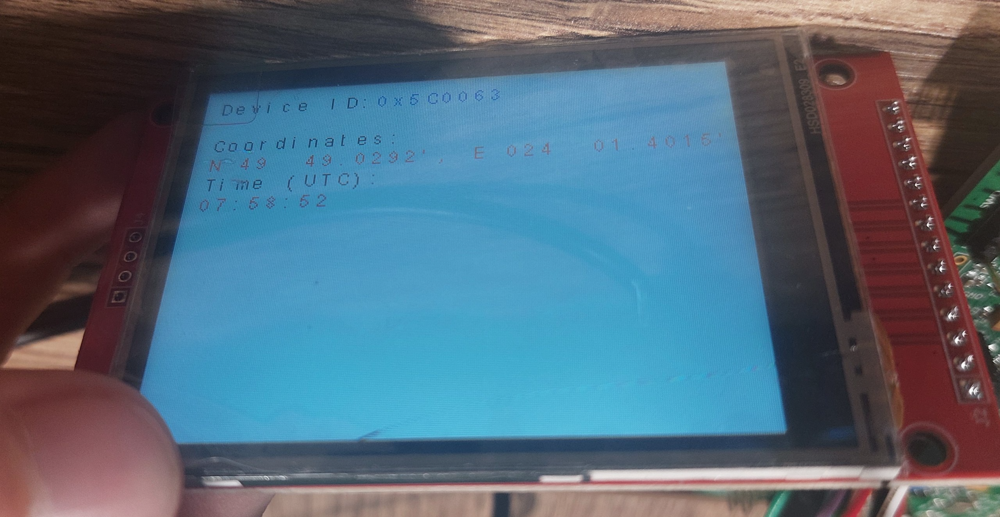
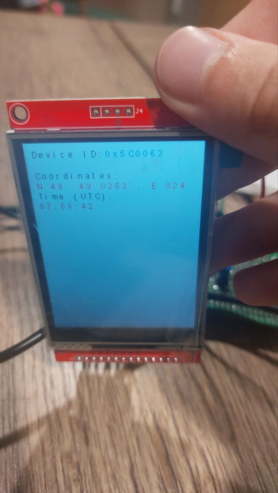
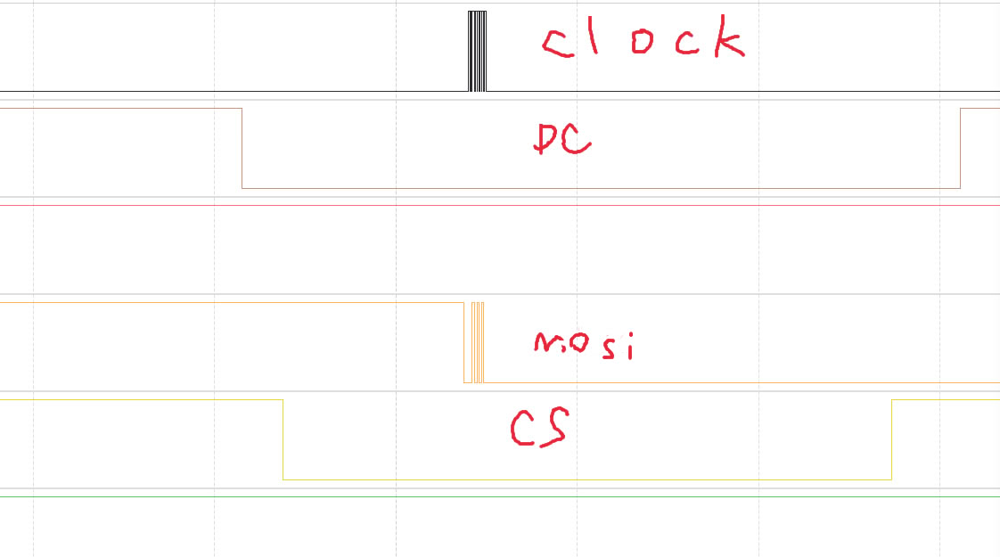

# Interfaces-lab
  
  
### Тут дисплей з всіма потрібними виведеними даними. Також можна переглядати в вертикальному режимі:  

  
Все оновлюється плитками  

Також були проаналізовані дані logic аналайзером  

Бачимо, що D/C ставиться на дані, CS переводиться на low для пересилання даних до екрану, і в цей момент починають працювати мосі для пересилання даних по клоку.